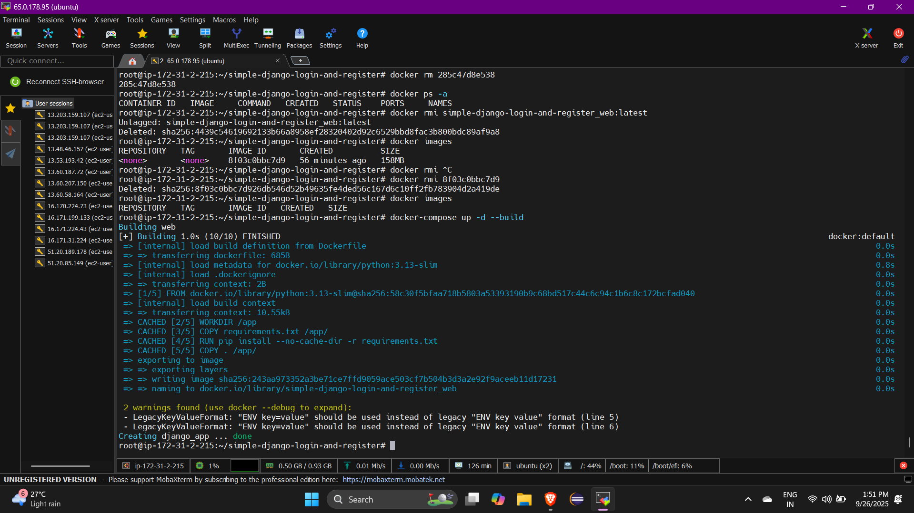
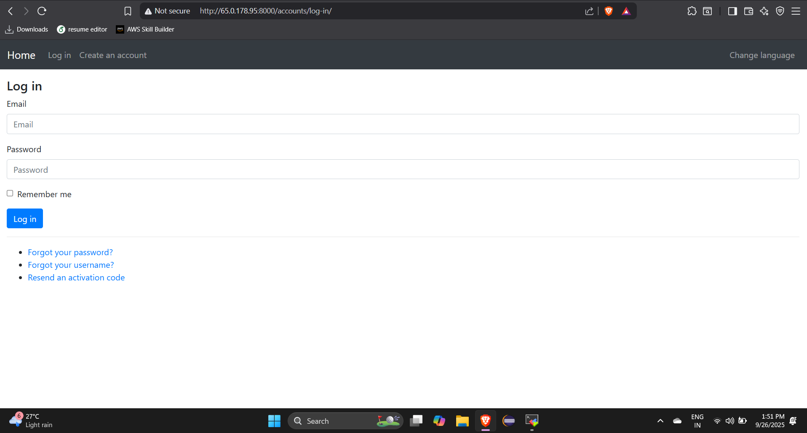

# Dockerizing Simple Django Login and Registration

[](https://github.com/vaishnavi08072000/Dockerize-django-login-app/actions/workflows/ci.yml)


An example of Django project with basic user functionality.

## Screenshots

| Log In | Create an account | Authorized page |
| -------|--------------|-----------------|
|  |  |  |

| Password reset | Set new password | Password change |
| ---------------|------------------|-----------------|
|  |  |  |

| Running in Docker | Accessing app in browser |
| ---------------|------------------|
|  |  | 

## Creating EC2 instances 
 # Installing OS:** Ubuntu 24.04.3 LTS (GNU/Linux 6.14.0-1011-aws x86_64)

 ## Packages Installed 
 1.Git
 
   ```bash
   sudo apt update
   sudo apt install git
   ```

 2.Docker

  ```bash
  sudo apt-get update
  sudo apt-get install ca-certificates curl
  sudo install -m 0755 -d /etc/apt/keyrings
  sudo curl -fsSL https://download.docker.com/linux/ubuntu/gpg -o /etc/apt/keyrings/docker.asc
  sudo chmod a+r /etc/apt/keyrings/docker.asc
  echo "deb [arch=$(dpkg --print-architecture) signed-by=/etc/apt/keyrings/docker.asc] https://download.docker.com/linux/ubuntu $(. /etc/os-release &&               echo "${UBUNTU_CODENAME:-$VERSION_CODENAME}") stable" | sudo tee /etc/apt/sources.list.d/docker.list > /dev/null
  sudo apt-get update
  sudo apt-get install docker-ce docker-ce-cli containerd.io docker-buildx-plugin docker-compose-plugin
  ```

 3.Apache
 
  ```bash
  sudo apt update
  sudo apt install apache2
  systemctl status apache2
  ```
 


### Functionality

- Log in
    - via username & password
    - via email & password
    - via email or username & password
    - with a remember me checkbox (optional)
- Create an account
- Log out
- Profile activation via email
- Reset password
- Remind a username
- Resend an activation code
- Change password
- Change email
- Change profile
- Multilingual: English, French, Simplified Chinese and Spanish

If you need dynamic URLs with the language code, check out https://github.com/egorsmkv/simple-django-login-and-register-dynamic-lang

## Installing

#### Clone the project

```bash
git clone https://github.com/vaishnavi08072000/Dockerize-django-login-app.git
cd Dockerize-django-login-app
```

### Activate virtualenv

##### Create a virtualenv using `uv`

```bash
uv venv --python 3.13

source .venv/bin/activate
```

###### Install dependencies

```bash
# uv sync --upgrade --extra dev

uv sync --upgrade

# Or using requirements files:

uv pip install -r requirements.txt
uv pip install -r requirements-dev.txt # in development mode
```

### Configure the settings (connection to the database, connection to an SMTP server, and other options)

1. Edit `source/app/conf/development/settings.py` if you want to develop the project.

2. Edit `source/app/conf/production/settings.py` if you want to run the project in production.

### Apply migrations

```bash
python source/manage.py migrate
```

### Running

####### On development server

Start the local web server:

```bash
python source/manage.py runserver
```

#### On production server

Collect static files:

```bash
python source/manage.py collectstatic
```


##### Dockerization

###### Dockerfile

Create a Dockerfile in your project root:

```bash
FROM python:3.11-slim
WORKDIR /app
COPY requirements.txt .
RUN pip install --no-cache-dir -r requirements.txt
COPY . .
EXPOSE 8000
CMD ["python", "manage.py", "runserver", "0.0.0.0:8000"]
```

##### .dockerignore

```bash
__pycache__
*.pyc
*.pyo
*.pyd
*.db
*.sqlite3
.env
venv/
```

##### Build the Docker image:

```bash
docker build -t django-login-app .
```

##### Run the Docker container:

```bash
docker run -p 8000:8000 django-login-app
```

###### App will be accessible at http://localhost:8000
 (or your server IP).

### Optional: Docker Compose (with PostgreSQL)

```bash
version: '3'

services:
  web:
    build: .
    command: python manage.py runserver 0.0.0.0:8000
    volumes:
      - .:/app
    ports:
      - "8000:8000"
    depends_on:
      - db

  db:
    image: postgres:15
    environment:
      POSTGRES_DB: mydb
      POSTGRES_USER: myuser
      POSTGRES_PASSWORD: mypassword
    ports:
      - "5432:5432"

```
##### Start with:

```bash
docker-compose up --build
       OR
docker-compose up -d --build
```


##### Development

#### Check & format code

This command formats the code:

```bash
just fmt
```
